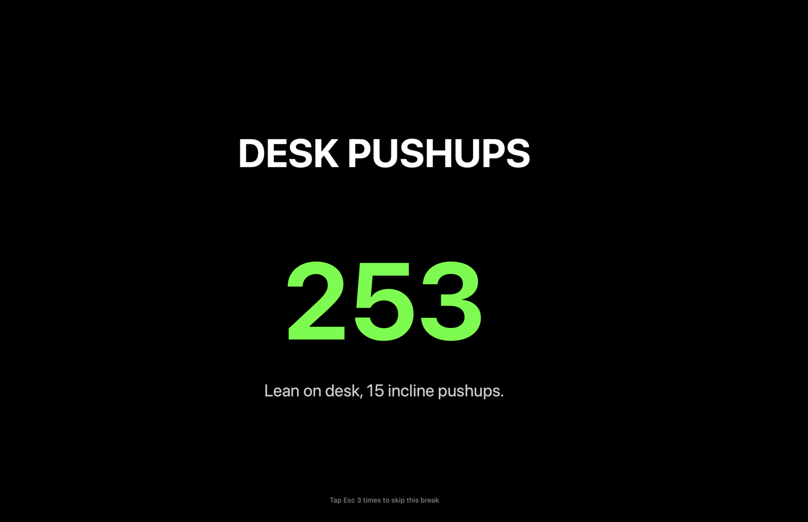
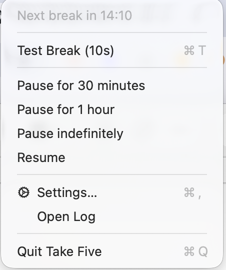
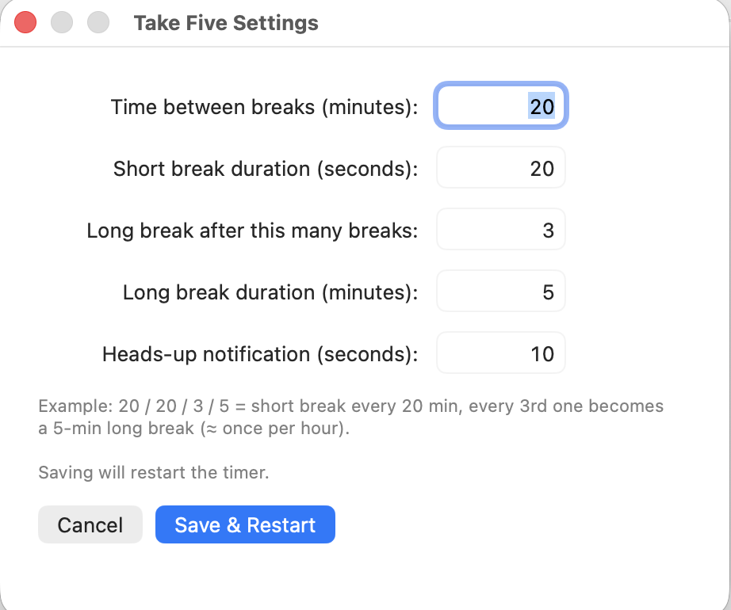

<p align="center">
  
</p>

<h1 align="center">Take Five</h1>

<p align="center">
  A 20-20-20 break reminder for macOS. Forces a fullscreen "look away" break every 20 minutes (eye rest) and a longer 5-minute break every hour (get up, stretch, walk, drink water).
</p>

<p align="center">
  Auto-skips during meetings, presentations, and idle time. Pause from the menu bar when needed.
</p>

## Screenshots

### When a break fires

A fullscreen black takeover with a randomized prompt (DESK PUSHUPS, LOOK AWAY, ROLL SHOULDERS, etc.), a countdown, and what to actually do. The hint at the bottom shows the escape: triple-tap Esc within 2 seconds to skip.

<p align="center">
  
</p>

### Menu bar dropdown

Click the **5** icon in your menu bar (top right of the screen) for live status, instant pause, settings, and quit.

<p align="center">
  
</p>

### Settings

Five fields, all in plain English. Saving restarts the timer immediately so changes take effect on the next break.

<p align="center">
  
</p>

## Features

- Native menu bar app with status, settings window, and one-click pause / resume
- 28 random reminders rotating each break: eyes, neck, shoulders, wrists, back, breath, hydrate, pushups, squats, plank, walk, stretch, lunges, and more
- Auto-skip during:
  - Camera in use (Zoom, Google Meet, Teams, FaceTime, Slack huddles, OBS)
  - Keynote or PowerPoint in presenting mode
  - Idle for more than 5 minutes
- Quick pause from menu bar: 30 min, 1 hour, indefinite
- Triple-tap Esc during a break to skip
- Multi-monitor: covers all displays
- Settings stored as JSON, easy to edit
- Logs to `~/Library/Logs/TakeFive.log`

## Requirements

- macOS 11 (Big Sur) or newer, **Apple Silicon** (M1/M2/M3/M4 etc.)
- No other dependencies. Prebuilt binaries are included.

## Install

1. Click the green **Code** button → **Download ZIP**
2. Unzip the file (Desktop is fine)
3. Double-click **`install.command`**
4. The first time, macOS will probably block it with this warning:
   > "install.command" cannot be opened because it is from an unidentified developer.

   To get past it:
   - **Right-click** (or hold **Control** and click) on `install.command`
   - Choose **Open** from the menu
   - Click **Open** again in the dialog that appears

   This is a one-time hurdle for unsigned apps. You only need to do it once per machine.
5. The installer copies Take Five to `/Applications`, removes the quarantine flag, and launches the app.
6. Look for the **5** icon in your menu bar (top right of screen).

### If the .app itself shows a warning

After install, if double-clicking the app shows:
> "Take Five" cannot be opened because Apple cannot check it for malicious software.

Open **System Settings → Privacy & Security**, scroll to the message about Take Five, and click **Open Anyway**. The installer normally strips the quarantine flag to prevent this.

### Auto-start at login

1. Open **System Settings**
2. Go to **General → Login Items & Extensions**
3. Under "Open at Login", click the **+** button
4. Pick **Take Five** in the Applications folder
5. Click **Open**

## Usage

Click the **5** icon in your menu bar:

| Menu item | What it does |
|---|---|
| Status | Shows time until next break, or pause status |
| Test Break (10s) | Preview the break window |
| Pause for 30 minutes | Skip breaks for 30 min |
| Pause for 1 hour | Skip breaks for 1 hour |
| Pause indefinitely | Stop until you click Resume |
| Resume | Resume from any pause |
| Settings | Change intervals (opens window with text fields) |
| Open Log | Diagnostic log |
| Quit Take Five | Fully stops the app |

### During a break

The black screen shows a countdown, headline (LOOK AWAY, ROLL SHOULDERS, etc.), and a tip.

To skip a break: **tap Esc 3 times in a row** within 2 seconds. The hint at the bottom counts down each tap.

(Cmd+Opt+Esc opens macOS Force Quit, but its dialog is hidden behind the break window since the break uses screensaver-level priority. Triple-Esc is the way out.)

## Configuration

Settings live at:
```
~/Library/Application Support/TakeFive/config.json
```

Editable via the Settings menu, or directly:

```json
{
  "workIntervalMin": 20,
  "shortBreakSec": 20,
  "longBreakEvery": 3,
  "longBreakMin": 5,
  "preWarningSec": 10
}
```

| Field | Default | Meaning |
|---|---|---|
| `workIntervalMin` | 20 | Minutes between breaks |
| `shortBreakSec` | 20 | Short break length in seconds |
| `longBreakEvery` | 3 | After this many breaks, do a long one |
| `longBreakMin` | 5 | Long break length in minutes |
| `preWarningSec` | 10 | Heads-up notification seconds before break |

Saving in the Settings window restarts the daemon, so changes take effect immediately.

## Architecture

```
TakeFive.app/
└── Contents/
    ├── Info.plist
    ├── MacOS/
    │   ├── TakeFive            Menu bar app (Swift, native Cocoa)
    │   └── break_window        Fullscreen break overlay (Swift)
    └── Resources/
        ├── AppIcon.icns        App icon
        ├── menubar.swift       Source for menu bar app
        ├── break_window.swift  Source for break overlay
        └── break_enforcer.py   Timer daemon (Python 3, stdlib only)
```

- **Menu bar app** (Swift): UI, settings window, controls, spawns the Python daemon
- **Python daemon**: timer loop, skip detection, fires the break window via subprocess
- **Break window** (Swift): native NSWindow at `CGShieldingWindowLevel` covering all screens

State / config files:
- `~/.takefive_pause` (pause expiry timestamp)
- `~/Library/Application Support/TakeFive/config.json` (settings)
- `~/Library/Application Support/TakeFive/state.json` (next break time)
- `~/Library/Logs/TakeFive.log` (diagnostic log)

## Build from source

The installer ships prebuilt arm64 binaries. To rebuild manually after editing source:

```bash
APP=/Applications/TakeFive.app
swiftc "$APP/Contents/Resources/menubar.swift"      -o "$APP/Contents/MacOS/TakeFive"
swiftc "$APP/Contents/Resources/break_window.swift" -o "$APP/Contents/MacOS/break_window"
```

Then restart:
```bash
pkill -f TakeFive
open /Applications/TakeFive.app
```

## Uninstall

1. Click the menu bar icon → **Quit Take Five**
2. Drag `/Applications/TakeFive.app` to the Trash
3. Optional cleanup:
   ```bash
   rm -rf ~/Library/Application\ Support/TakeFive
   rm -f  ~/Library/Logs/TakeFive.log
   rm -f  ~/.takefive_pause
   ```

## Troubleshooting

**5 icon doesn't appear after install.**
```bash
pkill -f TakeFive
open /Applications/TakeFive.app
```

**Break fires during a call it should have skipped.**
The skip detection looks for the camera being in active use. Browser tabs in Google Meet, Zoom Web, Teams Web all use the camera, so they should be caught. If a voice-only call slips through, click the menu bar icon and pick "Pause for 30 minutes".

**Can't dismiss the break.**
Tap Esc 3 times rapidly within 2 seconds. The hint at the bottom of the break window confirms each tap.

**Settings change didn't take effect.**
The Settings window restarts the daemon when you click Save. If the next break still uses the old timing:
```bash
pkill -f break_enforcer.py
open /Applications/TakeFive.app
```

**Logs.**
Click "Open Log" in the menu bar, or:
```bash
tail -f ~/Library/Logs/TakeFive.log
```

## License

MIT. See [LICENSE](LICENSE).
