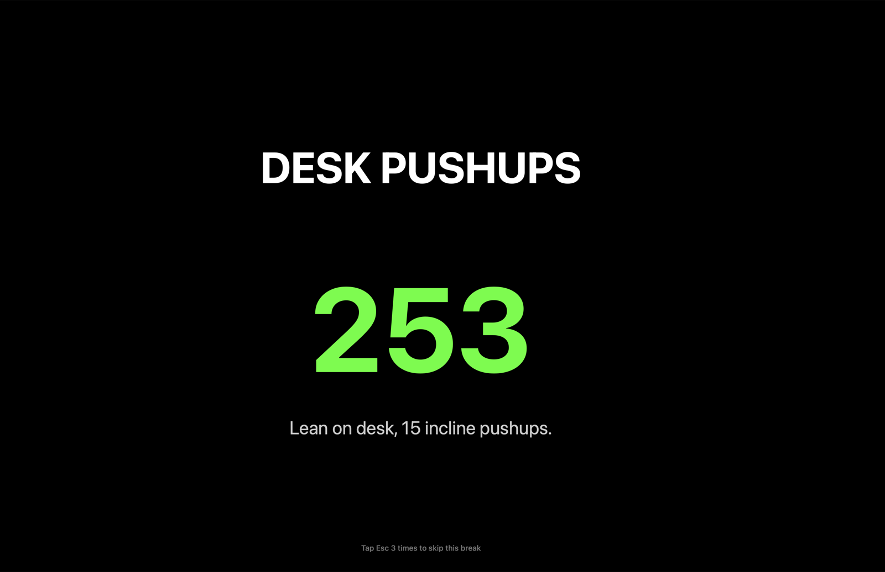
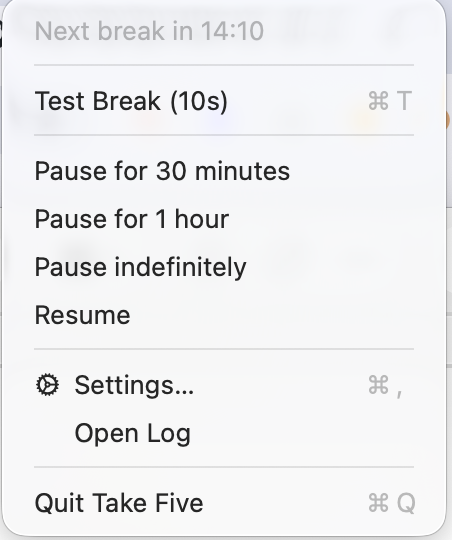
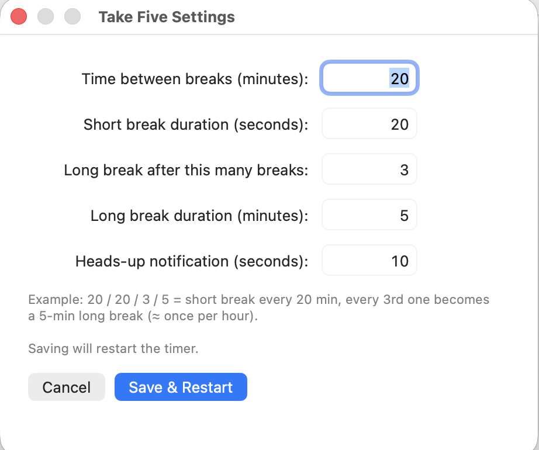

<p align="center">
  
</p>

<h1 align="center">Take Five</h1>

<p align="center">
  A 20-20-20 break reminder for macOS. Forces a fullscreen "look away" break every 20 minutes (eye rest) and a longer 5-minute break every hour (get up, stretch, walk, drink water).
</p>

<p align="center">
  Auto-skips during meetings, presentations, and idle time. Pause from the menu bar when needed.
</p>

## Screenshots

### When a break fires

A fullscreen black takeover with a randomized prompt (DESK PUSHUPS, LOOK AWAY, ROLL SHOULDERS, etc.), a countdown, and what to actually do. The hint at the bottom shows the escape: triple-tap Esc within 2 seconds to skip.

<p align="center">
  
</p>

### Menu bar dropdown

Click the **5** icon in your menu bar (top right of the screen) for live status, instant pause, settings, and quit.

<p align="center">
  
</p>

### Settings

Five fields and one checkbox, all in plain English. Saving restarts the timer immediately so changes take effect on the next break.

<p align="center">
  
</p>

## Features

- Native menu bar app with status, settings window, and one-click pause / resume
- 28 reminders rotating each break, never the same one twice in a row (full list below)
- Squats guaranteed once an hour, whatever else the shuffle picks
- Auto-skip during:
  - Any call, because something is holding the microphone. Covers Zoom, Google
    Meet, Teams, Slack, Discord and FaceTime, including audio-only calls and
    calls with your camera off
  - Screen sharing, presenting or recording
  - Keynote or PowerPoint in presenting mode
  - Idle for more than 5 minutes

  Watching a video is not treated as busy, so breaks still fire.
- Quick pause from menu bar: 30 min, 1 hour, indefinite
- Triple-tap Esc during a break to skip
- Multi-monitor: covers all displays
- Settings stored as JSON, easy to edit
- Logs to `~/Library/Logs/TakeFive.log`

## Exercises

Short breaks (20s by default) draw from these 14. Eyes first, plus small resets you can do at the desk.

| Headline | What to do |
|---|---|
| LOOK AWAY | Look 20 feet out a window. Hold it. |
| LOOK FAR | Find the farthest object in the room. Stare at it. |
| BLINK | Blink slowly 10 times. Screens dry your eyes. |
| EYE CIRCLES | Roll eyes clockwise 5x, then counter-clockwise. |
| PALM YOUR EYES | Cup warm palms over closed eyes. 20s of darkness. |
| ROLL SHOULDERS | Roll shoulders back 10 times. Drop them down. |
| NECK | Tilt head ear to shoulder. Both sides. Slowly. |
| WRISTS | Rotate wrists in circles. Shake them out. |
| STAND UP | Just stand. For 20 seconds. That's it. |
| BREATHE | Inhale 4s. Hold 4s. Exhale 6s. Twice. |
| UNCLENCH | Drop your jaw. Drop your shoulders. Soften your face. |
| ARCH BACK | Stand. Hands on lower back. Gently arch backward. |
| CALF RAISES | On your toes, then heels. 10 reps. |
| HYDRATE | Drink water. Right now. |

Long breaks (5 min by default) draw from these 13. Real movement, out of the chair.

| Headline | What to do |
|---|---|
| PUSHUPS | 10 pushups. Wall pushups count. Go. |
| PLANK | 60-second plank. Set a timer on your phone. |
| JUMPING JACKS | 30 jumping jacks. Heart rate up. |
| WALK | Walk to another room. Or outside. Just move. |
| STRETCH | Reach high. Fold to your toes. Hold each 20s. |
| HYDRATE + WALK | Refill water bottle. Walk while you sip. |
| YOGA FLOW | Sun salutation: fold, plank, cobra, downward dog. |
| LIE DOWN | Floor. Knees up, lower back flat. One full minute. |
| FRESH AIR | Step outside. Look at the sky. Breathe deeply. |
| DOORWAY STRETCH | Arms in doorframe, lean forward. 30s each side. |
| LUNGES | 10 lunges per leg. Slow. |
| DESK PUSHUPS | Lean on desk, 15 incline pushups. |
| HIP OPENERS | Pigeon pose or figure-4 stretch. Both sides. |

### Hourly squats

| Headline | What to do |
|---|---|
| SQUATS | 20 bodyweight squats. Slow and controlled. |

Squats are not in the random pool. They are pinned to one long break per hour, so
legs get a guaranteed dose instead of depending on the shuffle. The app claims
whichever long break lands nearest each hourly mark, so the long-run rate stays at
one squats break per hour no matter what interval you set. Turn it off with the
"Always squats on the first long break each hour" checkbox in Settings, or set
`squatsEveryHour` to `false` in the config file.

## Requirements

- macOS 11 (Big Sur) or newer, **Apple Silicon** (M1/M2/M3/M4 etc.)
- Meeting and presentation auto-skip asks for Automation permission the first
  time it checks Keynote, PowerPoint or Zoom. Allow it, or those skips will not
  work (breaks still fire normally).
- No other dependencies. Prebuilt binaries are included.

## Install

1. Click the green **Code** button → **Download ZIP**
2. Unzip the file (Desktop is fine)
3. Double-click **`install.command`**
4. The first time, macOS will probably block it with this warning:
   > "install.command" cannot be opened because it is from an unidentified developer.

   To get past it:
   - **Right-click** (or hold **Control** and click) on `install.command`
   - Choose **Open** from the menu
   - Click **Open** again in the dialog that appears

   This is a one-time hurdle for unsigned apps. You only need to do it once per machine.
5. The installer copies Take Five to `/Applications`, removes the quarantine flag, and launches the app.
6. Look for the **5** icon in your menu bar (top right of screen).

### If the .app itself shows a warning

After install, if double-clicking the app shows:
> "Take Five" cannot be opened because Apple cannot check it for malicious software.

Open **System Settings → Privacy & Security**, scroll to the message about Take Five, and click **Open Anyway**. The installer normally strips the quarantine flag to prevent this.

### Auto-start at login

1. Open **System Settings**
2. Go to **General → Login Items & Extensions**
3. Under "Open at Login", click the **+** button
4. Pick **Take Five** in the Applications folder
5. Click **Open**

## Usage

Click the **5** icon in your menu bar:

| Menu item | What it does |
|---|---|
| Status | Shows time until next break, or pause status |
| Test Break (10s) | Preview the break window |
| Pause for 30 minutes | Skip breaks for 30 min |
| Pause for 1 hour | Skip breaks for 1 hour |
| Pause indefinitely | Stop until you click Resume |
| Resume | Resume from any pause |
| Settings | Change intervals and the hourly squats toggle |
| Open Log | Diagnostic log |
| Quit Take Five | Fully stops the app |

### During a break

The black screen shows a countdown, headline (LOOK AWAY, ROLL SHOULDERS, etc.), and a tip.

To skip a break: **tap Esc 3 times in a row** within 2 seconds. The hint at the bottom counts down each tap.

(Cmd+Opt+Esc opens macOS Force Quit, but its dialog is hidden behind the break window since the break uses screensaver-level priority. Triple-Esc is the way out.)

## Configuration

Settings live at:
```
~/Library/Application Support/TakeFive/config.json
```

Editable via the Settings menu, or directly:

```json
{
  "workIntervalMin": 20,
  "shortBreakSec": 20,
  "longBreakEvery": 3,
  "longBreakMin": 5,
  "preWarningSec": 10,
  "squatsEveryHour": true,
  "busyApps": []
}
```

| Field | Default | Meaning |
|---|---|---|
| `workIntervalMin` | 20 | Minutes between breaks |
| `shortBreakSec` | 20 | Short break length in seconds |
| `longBreakEvery` | 3 | After this many breaks, do a long one |
| `longBreakMin` | 5 | Long break length in minutes |
| `preWarningSec` | 10 | Heads-up notification seconds before break |
| `squatsEveryHour` | true | Pin squats to one long break per hour |
| `busyApps` | [] | Extra app names to treat as busy, e.g. `["chrome"]` |

Saving in the Settings window restarts the daemon, so changes take effect immediately.

## Architecture

```
TakeFive.app/
└── Contents/
    ├── Info.plist
    ├── MacOS/
    │   ├── TakeFive            Menu bar app (Swift, native Cocoa)
    │   └── break_window        Fullscreen break overlay (Swift)
    └── Resources/
        ├── AppIcon.icns        App icon
        ├── menubar.swift       Source for menu bar app
        ├── break_window.swift  Source for break overlay
        └── break_enforcer.py   Timer daemon (Python 3, stdlib only)
```

- **Menu bar app** (Swift): UI, settings window, controls, spawns the Python daemon
- **Python daemon**: timer loop, skip detection, fires the break window via subprocess
- **Break window** (Swift): native NSWindow at `CGShieldingWindowLevel` covering all screens

State / config files:
- `~/.takefive_pause` (pause expiry timestamp)
- `~/Library/Application Support/TakeFive/config.json` (settings)
- `~/Library/Application Support/TakeFive/state.json` (next break time, break count, last squats break)
- `~/Library/Logs/TakeFive.log` (diagnostic log)

## Build from source

The installer ships prebuilt arm64 binaries. To rebuild manually after editing source:

```bash
APP=/Applications/TakeFive.app
swiftc "$APP/Contents/Resources/menubar.swift"      -o "$APP/Contents/MacOS/TakeFive"
swiftc "$APP/Contents/Resources/break_window.swift" -o "$APP/Contents/MacOS/break_window"
```

Then restart:
```bash
pkill -f TakeFive
open /Applications/TakeFive.app
```

## Uninstall

1. Click the menu bar icon → **Quit Take Five**
2. Drag `/Applications/TakeFive.app` to the Trash
3. Optional cleanup:
   ```bash
   rm -rf ~/Library/Application\ Support/TakeFive
   rm -f  ~/Library/Logs/TakeFive.log
   rm -f  ~/.takefive_pause
   ```

## Troubleshooting

**5 icon doesn't appear after install.**
```bash
pkill -f TakeFive
open /Applications/TakeFive.app
```

**Break fires during a call it should have skipped.**
Detection keys off the microphone being held, so any real call is covered,
camera on or off. Open the menu bar icon during the call: if it shows an
"Auto-skip" line, detection is working. To check from a terminal:

```bash
/usr/bin/python3 /Applications/TakeFive.app/Contents/Resources/break_enforcer.py skipreason
```

That prints the current reason, or nothing if a break would fire right now.
If a call still slips through, pick "Pause for 30 minutes" from the menu.

**Can't dismiss the break.**
Tap Esc 3 times rapidly within 2 seconds. The hint at the bottom of the break window confirms each tap.

**Settings change didn't take effect.**
The Settings window restarts the daemon when you click Save. If the next break still uses the old timing:
```bash
pkill -f break_enforcer.py
open /Applications/TakeFive.app
```

**Logs.**
Rotates at 1 MB, with the previous file kept as `TakeFive.log.1`.
Click "Open Log" in the menu bar, or:
```bash
tail -f ~/Library/Logs/TakeFive.log
```

## License

MIT. See [LICENSE](LICENSE).
